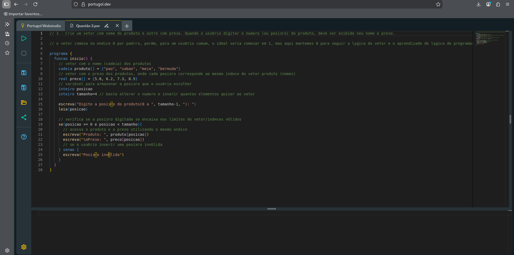
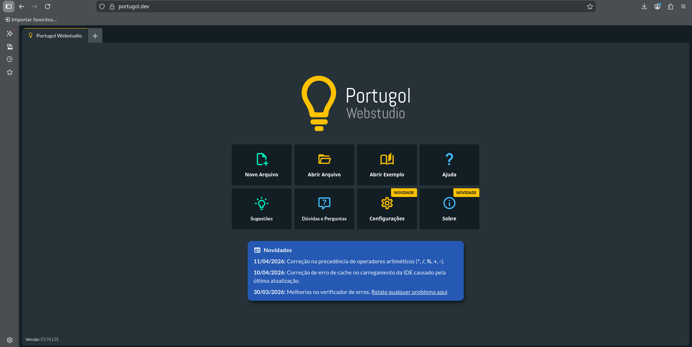

# Exercícios de Introdução à Programação (Portugol + Python)


Este repositório contém exercícios de lógica de programação desenvolvidos em Portugol, utilizando o [Portugol WebStudio](https://portugol.dev/)

## Estrutura

- `portugol/` → Exercícios em Portugol
- `python/` → Tradução dos exercícios para Python

## Conteúdo

Os exercícios incluem:

- Vetores e arrays
- Estruturas de repetição (for, while)
- Condicionais (if/else)
- Funções
- Lógica de programação básica
- Matemática básica (PA, PG, trigonometria e operações simples)
- Manipulação de dados simples

## Objetivo

Praticar lógica de programação e realizar a transição da pseudolinguagem Portugol para Python.

## Observações

- Exercícios desenvolvidos com foco em aprendizado acadêmico
- Foi priorizado o uso de `snake_case` na transição para Python, seguindo boas práticas da PEP 8

## Observação sobre acentuação

Alguns arquivos em Portugol podem apresentar problemas de acentuação ao serem abertos no Portugol WebStudio.

Isso ocorre devido a limitações de codificação (encoding UTF-8) da plataforma, e não ao código em si.

Os arquivos foram escritos corretamente, porém podem sofrer alterações visuais ao serem carregados no ambiente.

### Exemplo de código em Portugol



## Uso

- Para abrir os arquivos .por, basta direcionar-se ao Portugol Webstudio na opção de abrir arquivo
  


- Já os arquivos .py podem ser abertos normalmente em IDEs específicas como PyCharm, editores de código como Visual Studio Code ou outras aplicações de sua preferência

## Resumo de Estudo

### Variáveis
Armazenam valores na memória.

Exemplo:
- inteiro → números inteiros (1, 2, 10)
- real → números decimais (3.5, 10.2)
- cadeia → texto ("olá")
- lógico → verdadeiro ou falso

### Estruturas de repetição

#### while (enquanto)
Repete enquanto uma condição for verdadeira.

Exemplo:
```python
while x < 10:
    x += 1
```
Usado quando não sabemos exatamente quantas repetições terão.

#### for (para)

Repete um número definido de vezes.

Exemplo:
```python
for i in range(10):
    print(i)
```
Usado quando já sabemos a quantidade de repetições.

### Vetores (arrays/listas)

Estrutura que guarda vários valores em uma única variável.

Exemplo:
```python
numeros = [1, 2, 3, 4]
```
Cada posição tem um índice (começa em 0)

### Condicionais (if/else)

Tomam decisões no código.

Exemplo:
```python
if x > 10:
    print("maior")
else:
    print("menor")
```
### Funções

Blocos de código reutilizáveis.

Exemplo:
```python
def soma(a, b):
    return a + b
```
--- 

Este material foi desenvolvido para fins de estudo e prática de lógica de programação.
